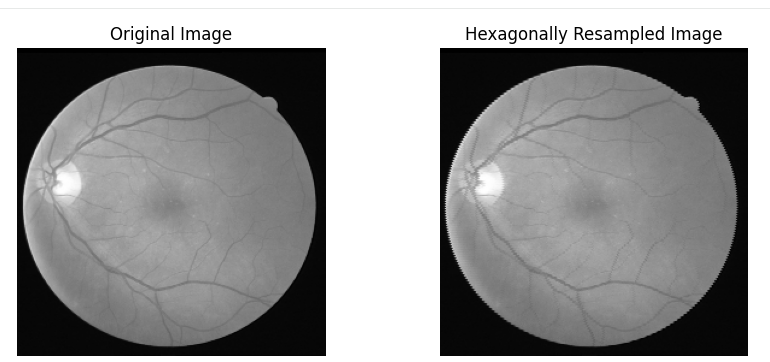
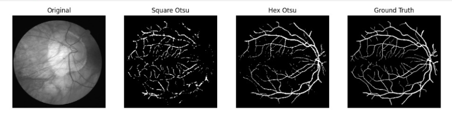
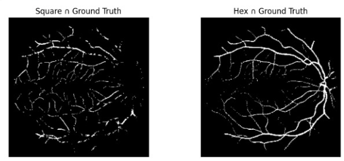
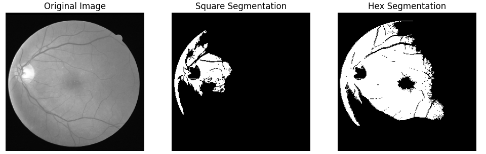
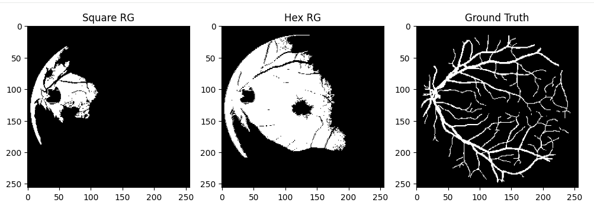
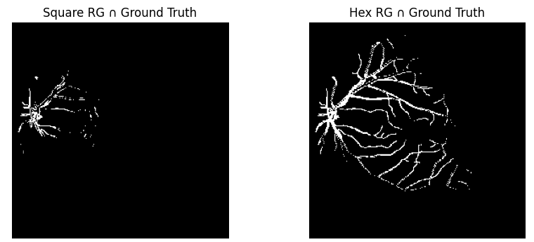

# Hexagonal Image Representation for Retinal Vessel Segmentation

## Overview
This project investigates the effectiveness of hexagonal image representation for improving retinal vessel segmentation. The study compares traditional square grids with hexagonally transformed images using both connectivity-based and intensity-based segmentation techniques.

## Methodology
- Square to hexagonal image transformation
- Segmentation methods:
  - Region Growing (connectivity-based)
  - Otsu Thresholding (intensity-based)
- Preprocessing:
  - Normalization
  - CLAHE (Contrast Limited Adaptive Histogram Equalization)
  - Black-hat morphological filtering
- Evaluation Metric:
  - Dice Similarity Coefficient

## Results

| Method            | Square Dice | Hex Dice |
|------------------|------------|----------|
| Region Growing   | 0.1153     | 0.2367   |
| Otsu Threshold   | 0.6567     | 0.6833   |

## Key Insights
- Hexagonal representation significantly improves connectivity-based segmentation.
- Moderate improvement observed in intensity-based segmentation (Otsu).
- Hex grids better preserve structural continuity of thin vessels.

## Dataset
DRIVE Dataset:
https://www.kaggle.com/datasets/andrewmvd/drive-digital-retinal-images-for-vessel-extraction

## Results Visualization

### Original vs Hex Representation

### Otsu Segmentation Comparison

### Otsu vs Ground Truth

### Region Growing Comparison

### Region Growing Ground Truth

### Region Growing Overlap

## Future Work
- Integration with deep learning models
- Improved hexagonal interpolation techniques
- Evaluation on larger and diverse datasets
